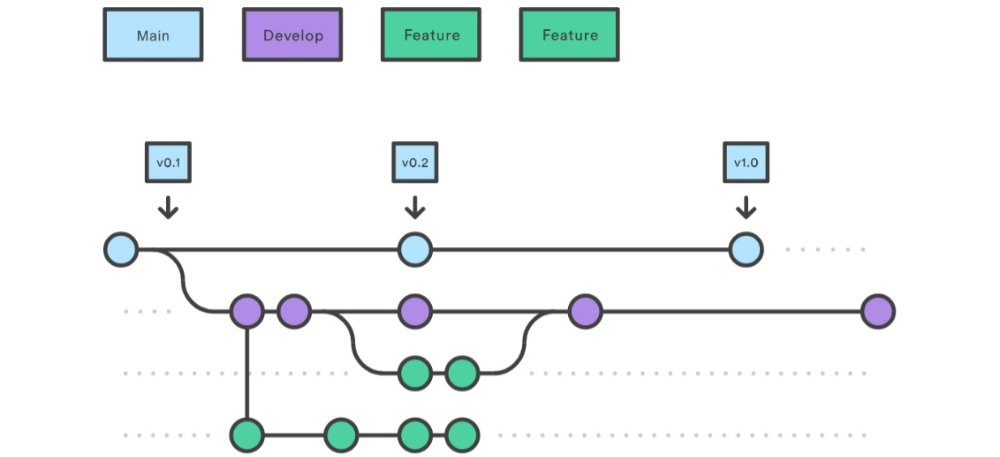
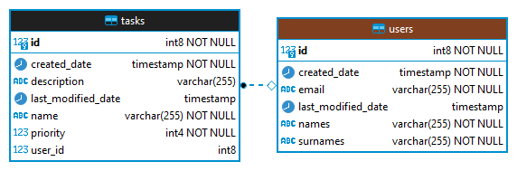

# CRUD Users API

Aplicación web para la gestión de tareas

## Instrucciones de ejecución

Instalar previamente las siguientes herramientas:

```text
Java 11
Maven 3.8.5
Git 2.35.1
```

Clonar el repositorio con el comando:

```sh
git clone https://raydiazvega@bitbucket.org/raydiazvega/crud-users-api.git
```

En la carpeta del proyecto ejecutar los comandos:

```sh
mvn clean package
java -jar target\crud-users-api-0.0.1-SNAPSHOT.jar
```

## Operaciones

### Usuarios

|             ENDPOINT             |          POST           |                    GET                    |           PUT           |            DELETE             |
|:--------------------------------:|:-----------------------:|:-----------------------------------------:|:-----------------------:|:-----------------------------:|
|             `/users`             | Create user, return 200 |        Find all users, return 200         | Update user, return 200 |  Delete all user, return 200  |
|          `/users/{id}`           | Not allowed, return 400 |        Find user by id, return 200        | Not allowed, return 400 | Delete user by id, return 200 |
|      `/users/email/{email}`      | Not allowed, return 400 |      Find user by email, return 200       | Not allowed, return 400 |    Not allowed, return 400    |
| `/users/createdDate/{from}/{to}` | Not allowed, return 400 | Find users between date range, return 200 | Not allowed, return 400 |    Not allowed, return 400    |

### Tareas

|        ENDPOINT         |          POST           |                GET                |           PUT           |            DELETE             |
|:-----------------------:|:-----------------------:|:---------------------------------:|:-----------------------:|:-----------------------------:|
| `/users/{userId}/tasks` | Create task, return 200 | Find tasks by user id, return 200 | Not allowed, return 400 |    Not allowed, return 400    |
| `/users/tasks/{taskId}` | Not allowed, return 400 |    Find task by id, return 200    | Not allowed, return 400 | Delete task by id, return 200 |
|     `/users/tasks`      | Not allowed, return 400 |      Not allowed, return 400      | Update task, return 200 |    Not allowed, return 400    |

## Pruebas

Se preparó un conjunto de pruebas unitarias en la ruta `src/test` con una cobertura del **90%**,
se pueden ejecutar las pruebas en la raíz del proyecto con el comando:

```sh
mvn test
```

## Decisiones tomadas

### Arquitectura del proyecto

````sh
├───main
│   ├───java
│   │   └───com
│   │       └───colpatria
│   │           └───crudusersapi
│   │               ├───config
│   │               ├───exception
│   │               └───user
│   │                   ├───application
│   │                   ├───dto
│   │                   └───infrastructure
│   │                       ├───adapters  
│   │                       └───ports     
│   └───resources
│       ├───static
│       └───templates
└───test
    ├───java
    │   └───com
    │       └───colpatria
    │           └───crudusersapi
    │               ├───constant
    │               └───user
    │                   └───infrastructure
    │                       └───adapters  
    └───resources
````

Para la estructura de directorios y paquetes se decidió utilizar **arquitectura hexagonal** para
separar los diferentes elementos de código en capas,
reduciendo el acoplamiento entre diferentes elementos y minimizando los cambios necesarios en los
elementos internos aunque los externos cambien.

### Estrategia de Branching



Como estrategia de branching se utilizó **Git flow**, ya que permite una mayor organización en el
flujo de integración.
Como ramas principales se usaron main y develop, y como auxiliares las ramas feature/ y release/.

### Persistencia y modelos de datos

Como base de datos de uso **H2**, una base de datos en memoria, para agilizar el proceso de
desarrollo.



Para el modelo de datos se implementó una relación de uno a muchos de la tabla `users` a `tasks`, en
este caso un usuario puede tener varias tareas.

## Conclusión

Finalmente, para el manejo de errores se usó un `RestControllerAdvice` para el manejo de excepciones
en toda la aplicación, permitiendo centralizar las respuestas de error en los casos contemplados.
Además, entre los distintos endpoints desarrollados se encuentra `/users/createdDate/{from}/{to}`
que permite filtrado por rango de fechas. Y se puede acceder a la documentation en swagger de la api
en la ruta`http://localhost:8080/crud-users-api/swagger-ui/index.html#/`